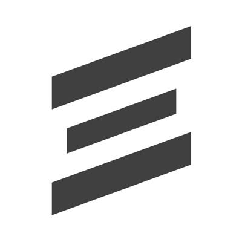

 

  
  <h3 align="center">
    <a href="https://www.saltedge.com/products/strong_customer_authentication">
      Salt Edge Strong Customer Authentication Solution
    </a>
  </h3>
  

     
    <a href="https://github.com/saltedge/sca-identity-service-example/wiki"><strong>Explore our Wiki »</strong></a>
     
     
  

# Authenticator Identity Service  

Authenticator Identity Service is a part of Bank (Service Provider) System that implements Strong Customer Authentication/Dynamic Linking process.  
The purpose of Identity Service is to add necessary functionality in order to implement SCA/DL.  

It contains an API, that processes received from Bank's Authentication Service information 
and appeals to the Authenticator app in order to get either action confirmation or denial from the customer.

## Motivation

We found that our clients are looking for SCA solution alongside with [PSD2](https://en.wikipedia.org/wiki/Payment_Services_Directive) compliance solutions and we decided to publish our solution to widespread our vision, how it should work, and how end-users will get best user experience.

## Project content

Repository contains simple examples of Authenticator Identity Service 
* [on Sinatra framework](saltedge-sca-service-sinatra/README.md); 
* [on Spring Boot framework](saltedge-sca-service-spring/README.md). 

It will help you to implement our solution in your system. 

We have already published Authenticator Identity Service mobile clients for Apple iOS and Google Android system.  
You can find source code of mobile application here: 
* [Authenticator iOS App source code](https://github.com/saltedge/sca-authenticator-ios) 
* [Authenticator Android App source code](https://github.com/saltedge/sca-authenticator-android).   

You can download mobile application:  
 
 
  
## How it works

#### Read [Authenticator Identity Service WIKI (Technical Overview)](https://github.com/saltedge/sca-identity-service-example/wiki)
#### Read [Authenticator Identity Service API reference](docs/IDENTITY_SERVICE_API.md) 
#### How to use [Sinatra Example](saltedge-sca-service-sinatra/README.md)
#### How to use [Spring-Boot Example & SDK](saltedge-sca-service-spring/README.md)
  
----  
## Contribute

In the spirit of [free software][free-sw], **everyone** is encouraged to help [improve this project](./CONTRIBUTING.md).

* [Contributing Rules](./CONTRIBUTING.md)  

[free-sw]: http://www.fsf.org/licensing/essays/free-sw.html

## Contact us

Feel free to [contact us](https://www.saltedge.com/pages/contact_support)

## License

***Salt Edge Authenticator (SCA solution) is multi-licensed, and can be used and distributed:***
- under a GNU GPLv3 license for free (open source). See the [LICENSE](LICENSE.txt) file.
- under a proprietary (commercial) license, to be used in closed source applications. 
  
[More information about licenses](https://github.com/saltedge/sca-identity-service-example/wiki/Multi-license).
  
***Additional permission under GNU GPL version 3 section 7***

If you modify this Program, or any covered work, by linking or combining it with [THIRD PARTY LIBRARY](THIRD_PARTY_NOTICES.md) (or a modified version of that library), containing parts covered by the [TERMS OF LIBRARY's LICENSE](THIRD_PARTY_NOTICES.md), the licensors of this Program grant you additional permission to convey the resulting work. {Corresponding Source for a non-source form of such a combination shall include the source code for the parts of [LIBRARY](THIRD_PARTY_NOTICES.md) used as well as that of the covered work.}  

___
Copyright © 2019 Salt Edge. https://www.saltedge.com  
