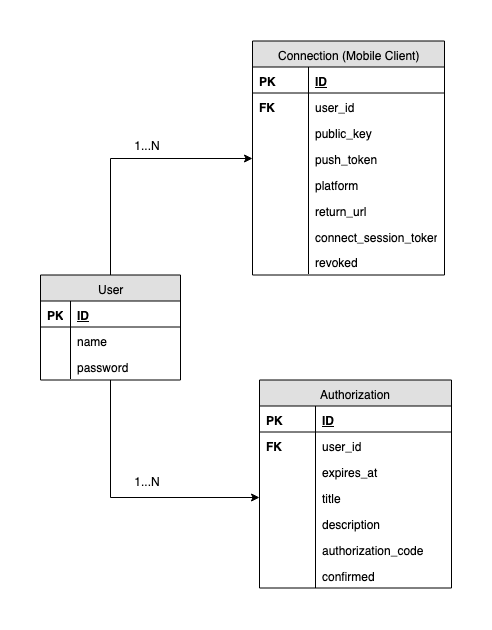

# Identity Service

* [What is Identity Service?](#what-is-identity-service)
* [Identity Service Models](#identity-service-models)
* [Deep Link](#deep-link)
* [API Security](#api-security)
* [API Errors](#api-errors)
* [Public API](#identity-service-api)
  * [API Data Types](#api-data-types)
  * [Get Configuration](#get-service-provider-configuration)
  * [Connect to Service Provider](#connect-to-service-provider)
  * [Obtain Access Token](#obtain-access-token)
  * [Revoke Access Token](#revoke-access-token)
  * [Show Authorizations List](#show-authorizations-list)
  * [Show Authorization](#show-authorization)
  * [Confirm or Deny Authorization](#confirm-or-deny-authorization)
* [Authorization code builder example](#authorization-code-builder-example)


## What is Identity Service?
  
[Identity Service WIKI](https://github.com/saltedge/sca-identity-service-example/wiki)  
  
The purpose of Identity Service is to process and store customer identities, roles, credentials, and add the necessary functionality in order to implement SCA. Hence, besides standard functionality, in Identity Service should be implemented additional functionalities and an API, as an extension to the existing Identity Service. The extension (additional functionality and API) processes received from Core banking information and appeals to the Authenticator app via Authentication Service in order to get either action confirmation or denial from the customer.

There is a little effort from Service Provider in order to implement the extension of Identity Service with 6 API end-points: 
* Connect to Service Provider; 
* Revoke Access Token; 
* Show Authorizations List; 
* Show Authorization; 
* Confirm or Deny Authorization.  
and add authentication/enrollment flow for `Obtaining Access Token`
  
Salt Edge has developed the SCA solution with such an architecture, having Identity Service in infrastructure of Service Provider, in order not to have any access to the personal information/credentials of the customer. All related to the customer private data is isolated from any third party or application and is controlled exclusively by the Service Provider.

Besides public API, may be implemented next useful end-points for internal usage (non-public):
* Revoke connection. For some reasons (security reason, cleaning job, etc.) Bank (Service Provider) should have possibility to revoke any connection
* Create new authorization. Identity service should create new authorization with data from request from Core banking (`authorization_code`, `title`, `description`, `user_id`), and send notifications (through Push Service) about new authorization to related connections.

## Identity Service Models



### User model
`User` represents an abstract single customer of Bank's Identity Service (e.g  Service Provider). This entity is already present in Bank's Identity Service.

### Connection (Mobile Client) model
`Mobile Client` represents a single connection between `User` and  Mobile Application. Each `User` can have multiple `Mobile Client`'s because user can have many connections to a single Service Provider from different applications.
  
- `id` - a unique ID string
- `user_id` - ID of related user model
- `public_key` - a unique Asymmetric Public Key in PEM format string
- `push_token` - a unique token string which uniquely identifies Mobile Application for the Push Notification system (i.e. unique address of current Mobile Application instance)
- `access_token` - a unique token string for authenticated access to API resources
- `return_url` - a URL the Mobile Application will be redirected to at the end of the authentication process
- `connect_session_token` - a unique token string for authentication session process
- `revoked` - a boolean value which indicates that connection is active or revoked
- `created_at` - a datetime
- `updated_at` - a datetime

### Authorization model
`Authorization` represents a single action for user. Each `User` can have multiple `Authorization`'s.
  
- `id` - a unique ID string
- `user_id` - ID of related user model
- `expires_at` - a datetime which indicates period of validity of authorization action
- `title` - title of authorization action
- `description` - description of authorization action
- `authorization_code` - generated unique code per each authorization action based on set of input information (datetime, amount, payee, account, etc.)
- `confirmed` - a boolean value which indicates that Authorization was confirmed or denied
- `created_at` - a datetime
- `updated_at` - a datetime


### Log model
- `id` - a unique ID string
- `message` - logged message as JSON
- `signature` - signed message 
- `public_key` - a unique Asymmetric Public Key in PEM format string
- `created_at` - a datetime

### Push Server Configuration
 - `push_server_url` - a URL of Push Server
 - `push_server_app_id` - a unique token string, released by Push Server owner
 - `push_server_app_secret` - a unique token string, released by Push Server owner

***Optional***, if Push Service is implemented inside Identity Service.

## Deep Link

For initiating connect flow, service should generate deep-link for initiating connection in mobile application. Deep-link can be encoded as QR code. 
Deep-link should contain link to configuration endpoint (`configuration` param):  
``` 
  authenticator://saltedge.com/connect?configuration=https://saltedge.com/configuration
```  

Deep-link can contain extra authentication data (`connect_query` param). This connect flow is named "Instant Enrollment".  
Additional authentication parameter should be sent while [connecting to provider](#connect-to-service-provider):  
``` 
  authenticator://saltedge.com/connect?configuration=https://saltedge.com/configuration&connect_query=A12345678
```  
More information on "Instant Enrollment" can be found [here](https://github.com/saltedge/sca-identity-service-example/wiki/Value-added-features#instant-enrollment).

---

## API Security
The following section describes the different security approaches used for securing data flow.

- All sensitive data should be encrypted (e.g. 2048-bit keys).
- All communications should be performed over HTTPS channel with certificate issued by CA (self-signed certificates not allowed).
- All requests from clients should be signed (if possible). 
- The private key should be securely stored on client side. In case of possible security breach, the private key should be regenerated and the public key should be updated.

**Before all, service client should provide public key (Mobile Application to Identity Service or Identity Service to Push Service).**

### Signature Headers
The following headers are required for your request to be considered signed:
-   `Expires-at` - request expiration time as a UNIX time (seconds since Jan 01 1970) in UTC timezone. We suggest to use +1 minute from the current time. The maximum value is 1 hour from now in UTC, otherwise  `SignatureExpired` error will be raised;
-   `Signature`  -  `base64`  encoded  `SHA256`  signature of the string represented in the form  
`request_method|original_url|Expires-at|post_body`  
4 parameters concatenated with a vertical bar  `|`, signed with the client’s private key.

Example:
```
  Expires-at: "1570032760"
  Signature: "0H6xaZ8g67....H8="
```  
 
The fields  `request_method`, `original_url` and `post_body` from the `Signature` header represent:  
- `request_method` - lowercase method name of the HTTP request. Example: `get`, `post`, `put`, `delete`, etc.;
- `original_url`   - the full requested URL, with all its complementary parameters;
- `Expires-at`     - request expiration time as a UNIX time (seconds since Jan 01 1970) in UTC timezone, should be equal to `Expires-at` header parameter;
- `post_body`      - the request post body. Should be left empty if it is a GET request, or the body is empty;  
  
**Note:**  
**_Signature field on mobile app is being created with body which is equal to raw string of request payload.
As we know, sometimes in Web App Controller is received already parsed object. You must use raw string of request payload because signature generation/veification is very sensitive to `post_body` string._**
  
---

## API Errors
During any request on Salt Edge SCA Service side, a number of errors may appear. In order to standardize errors while still giving some degree of freedom in explaining an error callback, parameters should include both `error_class` and `error_message`. Error message serves the purpose of communicating the issue to the Client, whereas error class should be used by client application in order to be able to handle various scenarios.

Contents of the `error_message` are entirely up to the Salt Edge SCA Service, they may even be localized. However, values sent within `error_class` parameter should be from the standardized list. This list may and will be extended over time.
  
### Bad Request errors (code: 400):  
* `WrongRequestFormat` - some of request params are not valid;
* `AccessTokenMissing` - `access_token` header is missing;
* `SignatureMissing` - `signature` header is missing;
* `SignatureExpired` - `expires_at` header is missing or `expires_at` is before now;
* `InvalidSignature` - `signature` param is invalid;
* `ActionExpired` - Action entity is expired.
  
### Unauthorized errors (code: 401):  
* `ConnectionNotFound` - connection associated with by `access_token` header not found or it is invalid;  
* `UserNotFound` - connection associated with Connection not found.  
  
### Not Found errors (code: 404):  
* `AuthorizationNotFound` - authorization queried by `authorization_id` param not found;  
* `ActionNotFound` - action queried by `action_id` param not found.
  
---
## Identity Service API

### API data types
The following section describes the different data types used for request and response data.

[JSON format](https://restfulapi.net/json-data-types/) is used for request/response data formatting. Since all data is eventually represented as UTF-8 strings, these types mostly define what characters are considered valid for data of a specific type. Additional validation rules may apply for specific parameters.  
Several primitive types:
**Boolean** - A case insensitive Boolean value, represented as either `true` or `false`.

**Integer** - An integer number. For example: `123`

**String** - A string of characters. For example: `"any string"`

**TimeStamp** - The time and date represented in ISO 8601 format (e.g. `2017-04-19T13:53:31Z`). The time and date must always be represented in the GMT time zone, even if the server or client uses a different default time zone.

**Array** - An array of values. Arrays are encoded by adding brackets.  For example: `"data": ["1", "2", "3"]`

**Object/Hashmap/Dictionary** - An associative array of values. For example: `"data": { id: "1", connection_id: "333" }`

### Headers

There are several common points about the request we send:
- The `Content-Type` header is  `application/json`;
- There is a `Signature` header that identifies the request was signed;
- There is a `Expires-at` header that identifies expiration time of the request;
- The JSON object sent will always have a  `data` field;
  
---
### Get Service provider configuration   
Public resource (not authenticated) for fetching of initial data of Service Provider.
Included in [deep-link](#qr-code). Endpoint can be arbitrary and not in Authenticator API namespace (`/api/authenticator/v1/`)
  
`GET` `configuration url from deep-link`

```bash
curl \
  -H 'Content-Type: application/json' \
  -X GET \
  https://connector.service_host.com/configuration
```

#### Response parameters
- `connect_url`   **[string, required]** - base URL of the Identity Service
- `code`          **[string, required]** - code of the Service Provider
- `name`          **[string, required]** - name of the Service Provider
- `logo_url`      **[string, optional]** - URL of the Service Provider's logo asset ([logo instruction](https://github.com/saltedge/sca-identity-service-example/wiki/How-to...%3F#correctly-fit-logo))
- `support_email` **[string, optional]** - email address of Provider's Customer Support
- `version`       **[string, required]** - required Authenticator API version

#### Example response
```json  
{
  "data": {
    "connect_url": "https://connector.service_host.com",
    "code": "demobank",
    "name": "Demobank",
    "logo_url": "https://connector.service_host.com/assets/logo.png",
    "support_email": "support@your_host.com",
    "version": "1"
  }
}
```  

**Note:**  
**[See Response Errors](#api-errors)**
  
---
### Connect to Service Provider
Create the new Mobile Client's model (i.e. Service Connection) and return Connect URL for future user authentication.

`POST` `/api/authenticator/v1/connections`  

```bash
curl \
  -H 'Content-Type: application/json' \
  -X POST \
  -d '{ "data": { "public_key": "-----BEGIN PUBLIC KEY-----\nMIGfMAGCSqGSIAB\n-----END PUBLIC KEY-----\n", "return_url": "authenticator://oauth/redirect", "platform": "android", "push_token": "e886d1a84cfa3cd5343b70a3f9971758e" } }' \
  https://connector.service_host.com/api/authenticator/v1/connections
```
  
#### Request Headers 
- `Accept-Language` **[string, optional]** - advertises which locale variant is preferred by client. By default `en`; 
  
#### Request Parameters
- `public_key` **[string, required]** - a unique Asymmetric Public Key linked to the new Mobile Client (Connection) in PEM format 
- `return_url` **[string, required]** - a URL the Mobile Application will be redirected to at the end of the authentication process
- `platform` **[string, required]** - mobile platform's name (e.g.  `android` or `ios`)
- `push_token` **[string, optional]** - a token which uniquely identifies Mobile Application for the Push Notification system (e.g. Firebase Cloud Messaging, Apple Push Notifications) (i.e. unique address of current Mobile Application instance). Sometimes is not available for current application.
- `provider_code` **[string, optional]** - code of the Service Provider
- `connect_query` **[string, optional]** - a token which uniquely identifies the user which require creation of new connection. It is Base64-encoded string that is embedded as query parameter in [Deep Link](#deep-link). Can be used for skipping of redundant authentication step in mobile client if user has passed it once before.  
  
#### Request Example
```json
{
  "data": {
    "public_key": "-----BEGIN PUBLIC KEY-----\nMIGfMAGCSqGSIAB\n-----END PUBLIC KEY-----\n",
    "return_url": "authenticator://oauth/redirect",
    "platform": "android",
    "push_token": "e886d1a84cfa3cd5343b70a3f9971758e",
    "provider_code": "demobank",
    "connect_query": "A12345678"
  }
}
```

#### Response Parameters
- `connect_url` **[string]** - a URL of Connect Web Page for future end-user authentication
- `id` **[string]** - a unique ID of current connection model.

#### Response Example
```json
{
  "data": {
    "connect_url": "https://connector.service_host.com/oauth/dbcde9971758e",
    "id": "333"
  }
}
```

if `connect_query` is valid (exist and not expired), then return the successful authentication url
```json
{
  "data": {
    "connect_url": "authenticator://oauth/redirect?id=333&access_token=Oqws977brjJUfXbEnGqHNsIRl8PytSL60T7JIsRBCZM",
    "id": "333"
  }
}
```

**Note:**  
**[See Response Errors](#api-errors)**
  
---
### Obtain access token
Client (WebView on Mobile Application) should open `connect_url` and user should pass authentication procedure.  
When authentication flow is finished, client will be redirected to URL which should start with `return_url` ([passed on Connect](#connect-to-service-provider)) and extra params. Once client has captured the redirect URL, it has to deserialize the JSON-encoded URL path following the custom scheme and the host.

#### Redirect Parameters of successful authentication
- `id` **[string, required]** - a unique ID of Connection
- `access_token` **[string, required]** - a unique token for future authenticated access to API resources

#### Example of successful authentication
```
  authenticator://oauth/redirect?id=333&access_token=Oqws977brjJUfXbEnGqHNsIRl8PytSL60T7JIsRBCZM
```
*The URL will be URLEncoded (percent-encoded),  the URL above is not URLEncoded to preserve its readability.*

#### Redirect Parameters of failed authentication
- `error_class` **[string, required]** - a class name which describes occurred error
- `error_message` **[string, required]** - a human-readable error message

#### Example of failed authentication
```
  authenticator://oauth/redirect?error_class=WRONG_CREDENTIALS&error_message=Wrong login or password
``` 
*The URL will be URLEncoded (percent-encoded), the URL above is not URLEncoded to preserve its readability.*

---
### Revoke Access token
Invalidates a Mobile Client by `Access-Token` (in header).  
  
`DELETE` `/api/authenticator/v1/connections`  
  
```bash
curl \
  -H 'Content-Type: application/json' \
  -H 'Access-Token: replace_with_your_token' \
  -H 'Expires-at: expires_at_time' \
  -H 'Signature: generated_signature' \
  -X DELETE \
  https://connector.service_host.com/api/authenticator/v1/connections
```
  
#### Request Headers 
- `Accept-Language` **[string, optional]** - advertises which locale variant is preferred by client. By default `en`; 
- `Access-Token` **[string, required]** - access token, required to access resources which require authentication. 
- `Expires-at` **[datetime, required]** - request expiration time as a UNIX time (seconds since Jan 01 1970) in UTC timezone, required to access resources which verify request signature.
- `Signature` **[string, required]** - signed by Asymmetric Key string, required to access resources which verify request signature.

#### Response Parameters
- `success` **[boolean]** - result of deletion
- `access_token` **[string]** - revoked access token

#### Response Example 
```json
{
  "data": {
    "success": true,
    "access_token": "Oqws977brjJUfXbEnGqHNsIRl8PytSL60T7JIsRBCZM"
  }
}
```

**Note:**  
**[See Response Errors](#api-errors)**
  
---
### Show Authorizations List
Return list of all current Authorizations which require end-user confirmation for Service Provider by `Access-Token` from headers.  
Each Authorization's `data` (authorization data) is encrypted with algorithm mentioned in `algorithm` param. Necessary data for decryption (`key` and `iv`) are encrypted by asymmetric `public_key` sent on (creating new connection)[#connect-to-service-provider] earlier.  

`GET` `/api/authenticator/v1/authorizations`  
  
```bash
curl \
  -H 'Content-Type: application/json' \
  -H 'Access-Token: replace_with_your_token' \
  -H 'Expires-at: expires_at_time' \
  -H 'Signature: generated_signature' \
  -X GET \
  https://connector.service_host.com/api/authenticator/v1/authorizations
```
  
#### Request Headers 
- `Accept-Language` **[string, optional]** - advertises which locale variant is preferred by client. By default `en`; 
- `Access-Token` **[string, required]** - access token, required to access resources which require authentication. 
- `Expires-at` **[datetime, required]** - request expiration time as a UNIX time (seconds since Jan 01 1970) in UTC timezone, required to access resources which verify request signature.
- `Signature` **[string, required]** - signed by Asymmetric Key string, required to access resources which verify request signature. 

#### Response Body Parameters
- `id` **[string]** - a unique ID of authorization model
- `connection_id` **[string]** - a unique ID of Mobile Client (Service Connection). Used to decrypt models in the Mobile Application
- `iv` **[string]** - an initialization vector of encryption algorithm, this string is encrypted with public key linked to Mobile Client
- `key` **[string]** - a secure key of encryption algorithm, this string is encrypted with public key linked to Mobile Client
- `algorithm` **[string]** - encryption algorithm and block mode type
- `data` **[string]** - encrypted authorization payload with algorithm mentioned above

#### Response Example
```json
{
  "data": [
    {
      "id": "444",
      "connection_id": "333",
      "iv": "o3TDCc3rKYTx...RVH+aOFpS9NIg==\n",
      "key": "BtV7EB3Erv8xEQ.../jeBRyFa75A6po5XlwWiEiuzQ==\n",
      "algorithm": "AES-256-CBC",
      "data": "YlnrNOHvUIPem/O58rMzdsvkXidLvgGpdMalD9c1mlg=\n"
    }
  ]
}
```

#### Authorization Payload Parameters (Decrypted payload)  
- `id` **[string]** - a unique ID of authorization model
- `connection_id` **[string]** - a unique ID of Mobile Client (Service Connection). Used to decrypt models in the Mobile Application
- `title` **[string]** - a human-readable title of authorization action
- `description` **[string]** - a human-readable description of authorization action
- `authorization_code` **[string]** - a unique code for each operation (e.g. payment transaction), specific to the attributes of operation, must be used once
- `created_at` **[datetime]** - time when the authorization was created
- `expires_at` **[datetime]** - time when the authorization should expire

#### Authorization Payload Example (Decrypted payload)  
```json
{
  "id": "444",
  "connection_id": "333",
  "title": "Create payment",
  "description": "Create payment 111.0 EUR for ...",
  "authorization_code": "123456789",
  "created_at": "2017-09-22T08:29:03Z",
  "expires_at": "2017-09-22T08:34:03Z"
}
```

**Note:**  
**[See Response Errors](#api-errors)**
  
---
### Show Authorization
Return the one authorization which requireы end-user confirmation for Service Provider by `Access-Token` from headers and by `id` parameter.
Each Authorization's `confirmation_data` is encrypted with algorithm mentioned in `algorithm` param. Necessary data for decryption (`key` and `iv`) are encrypted by asymmetric `public_key' sent on (creating new connection)[#connect-to-service-provider] earlier.

`GET` `/api/authenticator/v1/authorizations/:authorization_id` 
  
```bash
curl \
  -H 'Content-Type: application/json' \
  -H 'Access-Token: replace_with_your_token' \
  -H 'Expires-at: expires_at_time' \
  -H 'Signature: generated_signature' \
  -X GET \
  https://connector.service_host.com/api/authenticator/v1/authorizations/444
```
  
#### Request Path Parameters
- `authorization_id` **[string, required]** - a unique code of authorization model 

#### Request Headers 
- `Accept-Language` **[string, optional]** - advertises which locale variant is preferred by client. By default `en`; 
- `Access-Token` **[string, required]** - access token, required to access resources which require authentication. 
- `Expires-at` **[datetime, required]** - request expiration time as a UNIX time (seconds since Jan 01 1970) in UTC timezone, required to access resources which verify request signature.
- `Signature` **[string, required]** - signed by Asymmetric Key string, required to access resources which verify request signature.  

#### Response Parameters
- `id` **[string]** - a unique code of authorization model  
- `connection_id` **[string]** - a unique ID of Mobile Client (Service Connection). Used to decrypt models in the Mobile Application
- `iv` **[string]** - an initialization vector of encryption algorithm, this string is encrypted with public key linked to Mobile Client
- `key` **[string]** - a secure key of encryption algorithm, this string is encrypted with public key linked to Mobile Client
- `algorithm` **[string]** - encryption algorithm and block mode type
- `data` **[string]** - encrypted authorization payload with algorithm mentioned above

#### Response Example
```json
{
  "data": {
    "id": "444",
    "connection_id": "333",
    "iv": "o3TDCc3rKYTx...RVH+aOFpS9NIg==\n",
    "key": "BtV7EB3Erv8xEQ.../jeBRyFa75A6po5XlwWiEiuzQ==\n",
    "algorithm": "AES-256-CBC",
    "data": "YlnrNOHvUIPem/O58rMzdsvkXidLvgGpdMalD9c1mlg=\n"
  }
}
```

#### Authorization Payload Parameters (Decrypted payload)  
- `id` **[string]** - a unique ID of authorization model
- `connection_id` **[string]** - a unique ID of Mobile Client (Service Connection). Used to decrypt models in the Mobile Application
- `title` **[string]** - a human-readable title of authorization action
- `description` **[string]** - a human-readable description of authorization action
- `authorization_code` **[string]** - a unique code for each operation (e.g. payment transaction), specific to the attributes of operation, must be used once
- `created_at` **[datetime]** - time when the authorization was created
- `expires_at` **[datetime]** - time when the authorization should expire

#### Authorization Payload Example (Decrypted payload)  
```json
{
  "id": "444",
  "connection_id": "333",
  "title": "Create payment",
  "description": "Create payment 111.0 EUR for ...",
  "authorization_code": "123456789",
  "created_at": "2017-09-22T08:29:03Z",
  "expires_at": "2017-09-22T08:34:03Z"
}
```

**Note:**  
**[See Response Errors](#api-errors)**
  
---
### Confirm or Deny Authorization
Confirms/Denies authorization model (e.g. payment, operation, etc) from Service Provider.  
Requests for Confirm and Deny are practicaly equal. The only difference in the value of `confirm` field.
For `Confirm`, field `confirm` should be `true`. For `Deny`, field `confirm` should be `false`.  

`PUT` `/api/authenticator/v1/authorizations/:authorization_id`  
  
```bash
curl \
  -H 'Content-Type: application/json' \
  -H 'Access-Token: replace_with_your_token' \
  -H 'Expires-at: expires_at_time' \
  -H 'Signature: generated_signature' \
  -X PUT \
  -d '{ "data": { "confirm": true, "authorization_code": "123456789" } }' \
  https://connector.service_host.com/api/authenticator/v1/authorizations/444
```
  
#### Request Path Parameters
- `authorization_id` **[string, required]** - a unique code of authorization model  

#### Request Headers 
- `Accept-Language` **[string, optional]** - advertises which locale variant is preferred by client. By default `en`; 
- `Access-Token` **[string, required]** - access token, required to access resources which require authentication. 
- `Expires-at` **[datetime, required]** - request expiration time as a UNIX time (seconds since Jan 01 1970) in UTC timezone, required to access resources which verify request signature.
- `Signature` **[string, required]** - signed by Asymmetric Key string, required to access resources which verify request signature.  

#### Request Body Parameters
- `confirm` **[boolean, required]** - Confirm (`true`) or Deny (`false`) authorization
- `authorization_code` **[string, required]** - a unique code for each action

#### Request Example
```json
{
  "data": {
    "confirm": true,
    "authorization_code": "123456789"
  }
}
```  

#### Response Parameters
- `success` **[boolean]** - result of confirm/deny operation. 
- `id` **[string]** - a unique ID of authorization model

#### Response Example 
```json
{
  "data": {
    "success": true,
    "id": "444"
  }
}
```  

**Note:**  
**[See Response Errors](#api-errors)**
  
----

## Authorization code builder example

If authorization code is generating as sha256, than resulting string should be Base64 encoded without paddings.
  
Ruby example:
```ruby
template = "#{payee_details}|#{amount}|#{time}|#{user_id}|#{description}|#{salt}"
authorization_code = Base64.urlsafe_encode64(Digest::SHA256.hexdigest(template), padding: false)
```

Java (JDK 8) example:
```java
    String template = payment.accountId.toString() + "|" + payment.amount + "|" + payment.getCreatedAt().toString() + 
        "|" + payment.user.id.toString() + " | " + payment.description + "|" + SALT;
    byte[] hashBytes = MessageDigest.getInstance("SHA-256").digest(template.getBytes(StandardCharsets.UTF_8));
    return Base64.getEncoder().withoutPadding().encodeToString(hashBytes);
```

----  
Copyright © 2019 Salt Edge. https://www.saltedge.com
